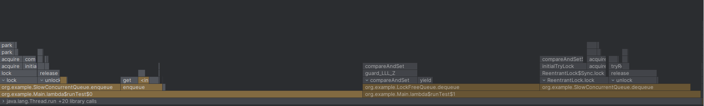
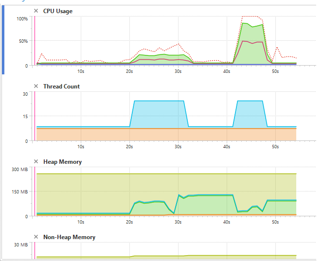
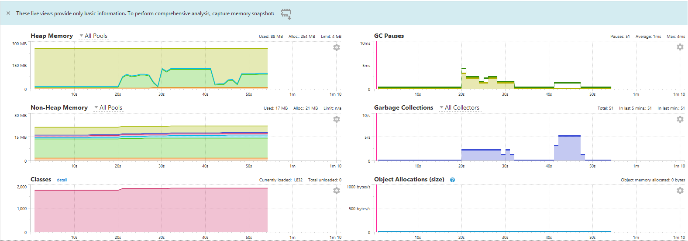
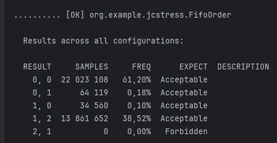
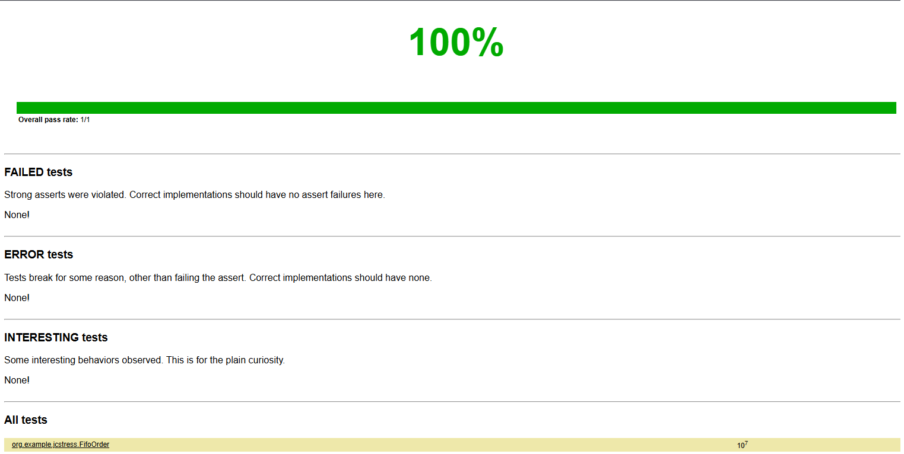
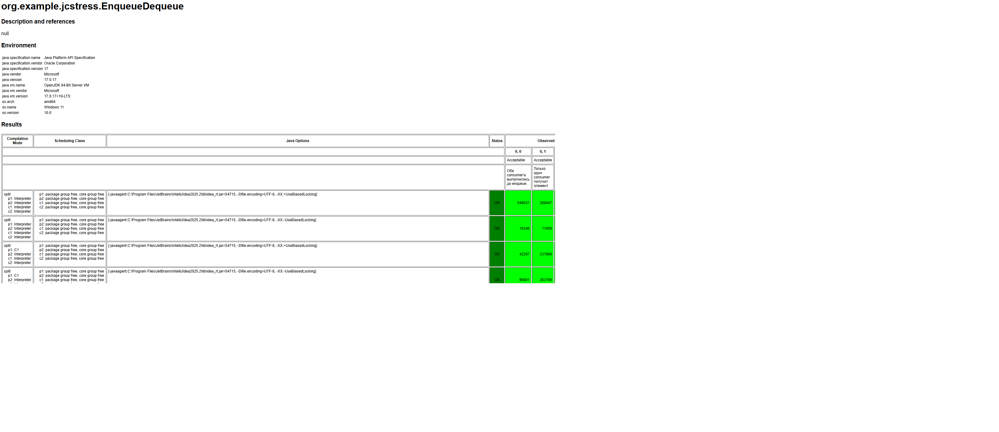

# Лабораторная работа 3: Lock-free очередь

## Описание
В данной лабораторной работе реализованы и протестированы два варианта конкурентных очередей в Java:

1. **SlowConcurrentQueue** — базовая блокирующая очередь с использованием ReentrantLock для синхронизации потоков.
- Очередь проста в реализации и корректно работает в многопоточной среде,
- Однако при высокой конкуренции блокировка становится узким местом, что ограничивает производительность.
2. **LockFreeQueue** — оптимизированная lock-free очередь, реализованная на основе алгоритма Michael–Scott.
- Использует AtomicReference для узлов и CAS-операции для обновления хвоста и головы,
- Включает adaptive backoff с Thread.onSpinWait() и Thread.yield() для уменьшения CAS-конфликтов,
- Полностью исключает блокировки, что позволяет нескольким потокам одновременно продвигать очередь, повышая пропускную способность.  

Цель работы — изучение конкурентных структур данных и моделей памяти Java, демонстрация навыков разработки lock-free алгоритмов, а также сравнительный анализ производительности блокирующей и lock-free очередей при высококонкурентной нагрузке.  

В рамках работы были реализованы операции вставки (enqueue) и извлечения (dequeue).
## **SlowConcurrentQueue**
### Характеристики:
- Очередь: блокирующая, синхронизация с помощью ReentrantLock
- Операции: enqueue и dequeue защищены блокировкой
- Поддержка многопоточности: корректно работает при одновременном доступе нескольких потоков
- Хранение элементов: связный список узлов Node<T> с volatile полями
### Сложность
- Вставка: O(1) амортизированно, но время зависит от конкуренции и времени ожидания lock
- Извлечение: O(1) амортизированно, аналогично

## **LockFreeQueue**
### Характеристики:
- Очередь: lock-free, на основе алгоритма Michael–Scott
- Синхронизация: CAS (AtomicReference) для головы и хвоста
- Adaptive backoff: Thread.onSpinWait() и Thread.yield() для снижения конфликтов при CAS
- Поддержка многопоточности: несколько потоков могут одновременно продвигать очередь без блокировок
- Хранение элементов: связный список узлов Node<T> с AtomicReference<Node<T>>
### Сложность
- Вставка: O(1) амортизированно при низкой конкуренции, повышается с количеством CAS-конфликтов
- Извлечение: O(1) амортизированно, аналогично
- При высокой конкуренции lock-free очередь показывает лучшую масштабируемость по сравнению с блокирующей
## Гипотезы
Основная гипотеза: Lock-free очередь даст заметный прирост производительности по сравнению с блокирующей очередью за счёт устранения блокировок и более эффективного параллельного доступа к данным:
- Блокировки в SlowConcurrentQueue создают узкое место при высокой конкуренции, из-за чего потоки простаивают, ожидая захвата ReentrantLock.
- Lock-free очередь (LockFreeQueue) устраняет эту проблему, позволяя нескольким потокам одновременно продвигать голову и хвост очереди с помощью CAS (AtomicReference).
- Adaptive backoff (Thread.onSpinWait() и Thread.yield()) снижает количество конфликтов на CAS, уменьшает нагрузку на шину памяти и повышает общую пропускную способность.
- Lock-free структура масштабируется лучше с ростом числа потоков, так как операции вставки и извлечения элементов могут выполняться параллельно без ожидания блокировки.  

## Бенчмарки
Результат бенчмарков:
|                             |  Threads   |    100000    |    500000    |    1000000     |
|-----------------------------|------------|--------------|--------------|----------------|
| **SlowConcurrentQueue**     |     4      | **63,83ms**  | **315,73ms** | **621,97ms**   |
| **LockFreeQueue**           |     4      | **55,29ms**  | **264,89ms** | **518,52ms**   |
| **SlowConcurrentQueue**     |     8      | **126,86ms** | **638,50ms** | **1202,27ms**  |
| **LockFreeQueue**           |     8      | **86,09ms**  | **367,01ms** | **744,78ms**   |
| **SlowConcurrentQueue**     |     16     | **260,69ms** | **1245,57ms**| **2527,57ms**  |
| **LockFreeQueue**           |     16     | **215,43ms** | **782,98ms** | **1542,15ms**  |
## Профилирование

Профилирование исходной реализации SlowConcurrentQueue и оптимизированной LockFreeQueue показало, что основное время выполнялось в ReentrantLock.lock() — до 75% CPU времени тратилось на ожидание блокировки при высокой конкуренции 16 потоков.  
Причинами низкой производительности были:
- Полное блокирование всех потоков на lock.lock() (15/16 потоков простаивали)
- Частые контекстные переключения при захвате/освобождении ReentrantLock
- False sharing полей head/tail в одной cache line, приводящий к инвалидации L1/L2 кэша  
В неоптимизированной версии видно, что большая часть обработки занимает переключение между потоками из-за полной блокировки.  
Также заметно, что оптимизированная версия проигрывает наивной версии, однако выполняется быстрее за счет lock-free принципа.  

## JCStress  
Для проверки корректности и потокобезопасности реализации lock-free очереди используются тесты JCStress (Java Concurrency Stress).  
Тестовые сценарии:  
- EnqueueDequeue — Проверяет, что при двух конкурентных enqueue и двух dequeue каждый добавленный элемент может быть получен ровно один раз — Результаты: target\jcstress-quick-1\index.html
- FifoOrder — Проверяет свойство FIFO: элементы должны извлекаться в том же порядке, в котором были добавлены — Результаты: target\jcstress-quick-2\index.html
- NoDuplication — Проверяет, что один и тот же элемент не может быть возвращён двум потокам одновременно — Результаты: target\jcstress-quick-3\index.html
- LockFreeProgressTest — Проверяет, что при одновременной работе производителя и потребителя система всегда демонстрирует прогресс — Результаты: target\jcstress-quick-4\index.html  
Все результаты идут в таком виде:  

## Модульные тесты 
Покрытие (Clover):
| Класс          | Методы | Строки |
|-------------------|--------|--------|
| **LockFreeQueue**      | 3/3    | 93.8%  |
| **LockFreeQueue.Node**    | 1/1    | 100% |
| **SlowConcurrentQueue** | 3/3 | 100%  |
| **SlowConcurrentQueue.Node** | 1/1 | 100%  |

## Выводы
В рамках лабораторной работы "Реализация и оптимизация конкурентных очередей в Java" успешно выполнены все поставленные задачи:
- Реализованы две версии очередей: SlowConcurrentQueue — блокирующая очередь с использованием ReentrantLock и LockFreeQueue — lock-free очередь на основе алгоритма Michael–Scott с CAS и adaptive backoff.  
Подтверждены гипотезы об оптимизациях:
- Lock-free подход устраняет узкое место, создаваемое блокировками, позволяя нескольким потокам одновременно выполнять операции enqueue и dequeue.
- Adaptive backoff снижает CAS-конфликты и нагрузку на CPU при высокой конкуренции.
- Lock-free структура обеспечивает более стабильный рост пропускной способности с увеличением числа потоков по сравнению с блокирующей очередью.  
Результаты экспериментов демонстрируют:
- SlowConcurrentQueue хорошо работает при малой конкуренции, но при большом числе потоков производительность резко падает из-за ожидания lock.
- LockFreeQueue сохраняет высокую пропускную способность при высокой конкуренции и большом числе операций, показывая преимущества lock-free подхода в многопоточной среде.  

Изучены инструменты:
- JMH для точных микробенчмарков
- IntelliJ Profiler для анализа горячих методов
- JCStress
- YourKit Java Profiler для телеметрии
- JUnit + Clover для проведения модульного тестирования
